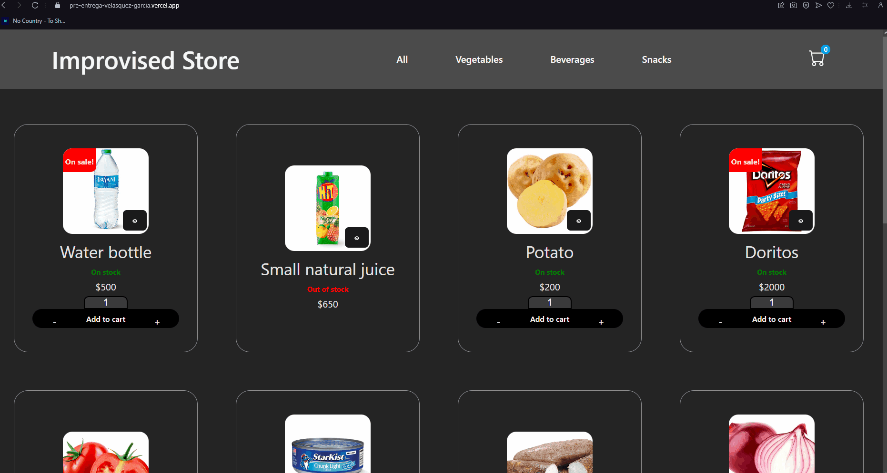
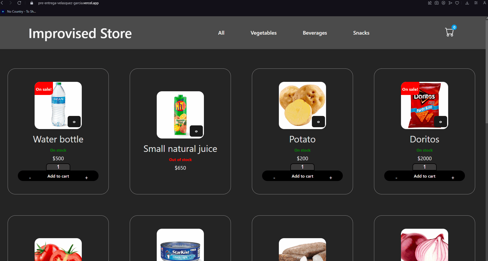
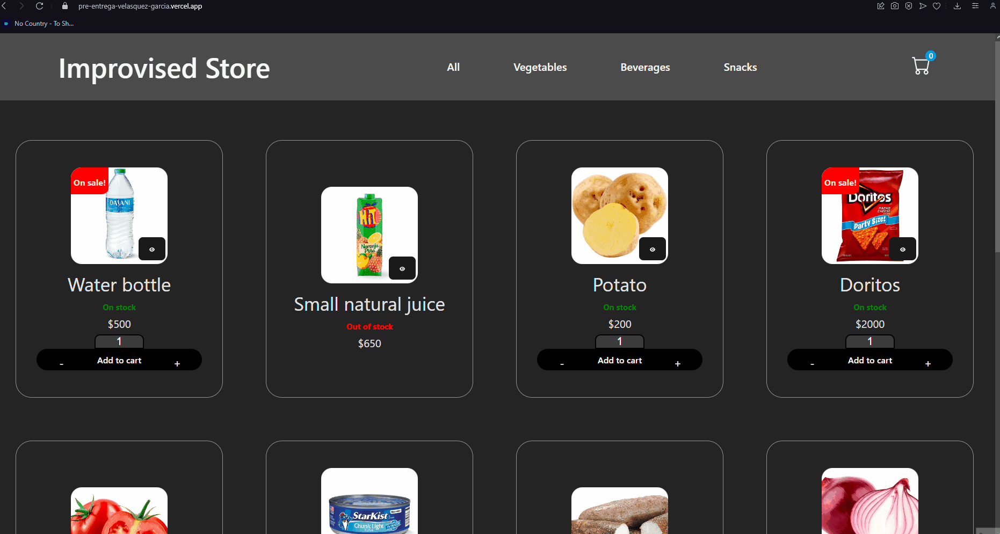
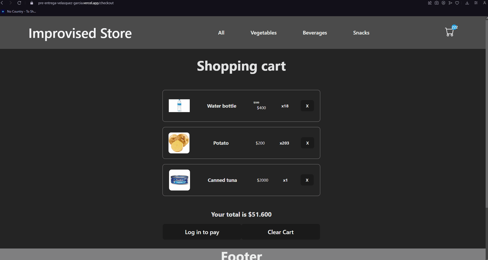
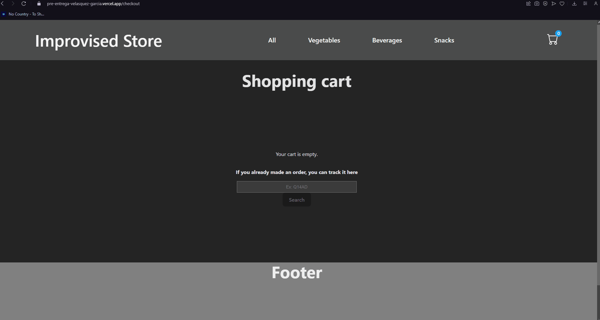

# React E-commerce sample

This project resembles a very simple store made with Vite + React using JSX and CSS (no css libraries) and Firebase as database backend; This repo was made for CoderHouse ReactJS course. To visit the store, please open the link located at the top right of this repo inside the "About" section.

# Used packages

This project uses [Toastify](https://fkhadra.github.io/react-toastify/introduction) for "add to cart" notifications, [SweetAlert2](https://sweetalert2.github.io) for status pop ups, [UI Ball](https://uiball.com/loaders/) for loading effects and [React Router DOM](https://reactrouter.com/en/main) for navigation routes within the app.

The components and pages on this repo are organized with the component name for easier visualization; This also applies for components styling sheets (css).

Aditionally, this project uses [Firebase](https://firebase.google.com) as database for loading products, fetching and placing order data and authentication.

## Features

- Navigable product categories. 
- Adding and removing products from the cart.
- Product fetch from fire storage database.
- Product preview (contains item name, description, price, sale (if available) and quantity selector).
- Product stock and sale badges (displayed based on fire storage info).
- Simple sign in and sign out system for placing orders.
- Generate orders and check their summary by using their order code.

## Media

#### Navigation
)
#### Product detail

#### Add to cart

#### Login and pay product

#### Find order

